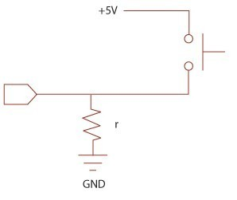

# PCBPrint Button

Vamos a detectar el contacto de un pulsador en configuración Pull Down (leeremos 0 cuando no esté pulsado)

El circuito será:

Una primera versión

Por el lado de los componentes

Y por el lado de la soldadura

