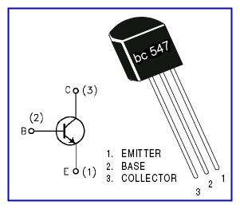
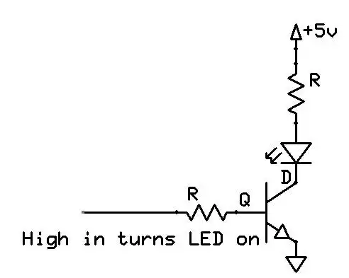

# PCBPrint LED para transistor bc547 o compatible

Se trata de una nueva versión del PCBPrint LED para transistores NPN con patillaje compatible con el transistor bc547

El móntaje es el típico de un transistor para activar una carga (en este caso un simple LED). Aunque para un led no sería necesario, este montaje nos va a permitir trabajar con placas que proporcionan menos intensidad por pin (por ejmemplo la Alhambra ICEZum) o con led más potentes

Usaremos un PCBPrint de prototipo para hacer un montaje con éste  resultado:

