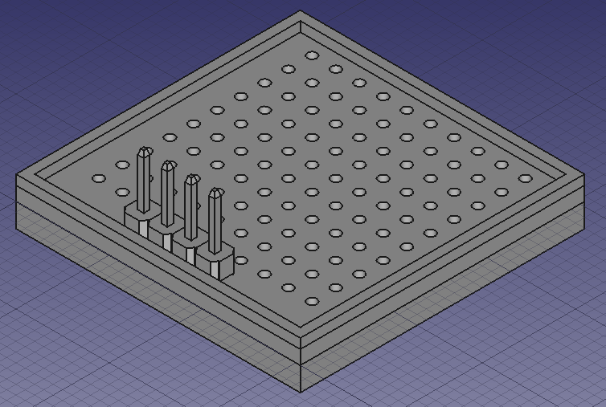
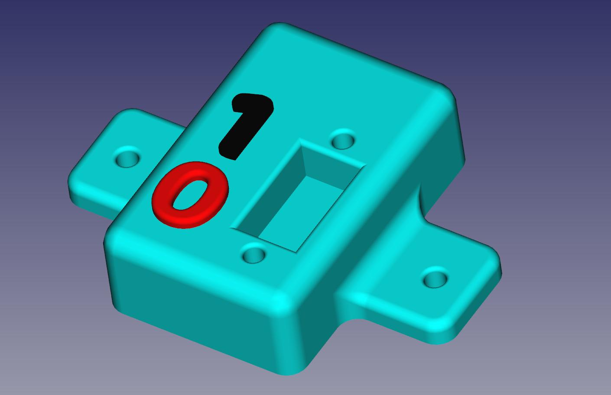
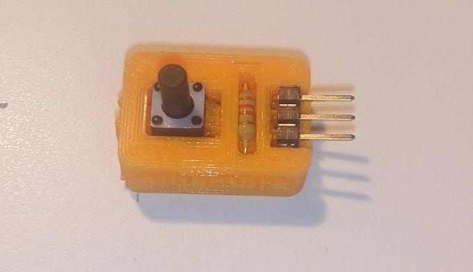
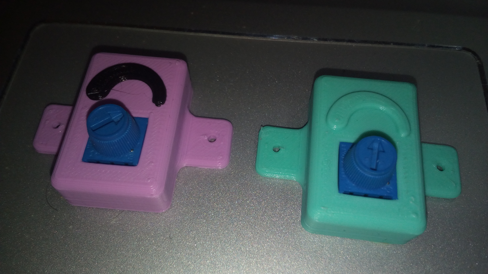

# PCbPrints
Se trata de piezas imprimibles que permiten crear circuitos sencillos.

El [primer diseño fue del maestro @obijuan](https://github.com/Obijuan/3D-parts/tree/master/2016-10-11-printable-led-pcb)

y este otro diseño [más elaborado](https://github.com/FPGAwars/alhambra-led) y capaz de entregar más corriente al led (pensado para trabajar con la [IceZum Alhambra FPGA](https://github.com/FPGAwars/icezum))

A partir de aquí han sido varias las propuestas como el [PCBPrint semáforo](https://github.com/movilujo/designs_3D/tree/master/PCBprint) de @Movilujo (Inventor del nombre PCBPrint)

y algún otro que no tengo localizado en github

## PCBProtoPrint

Primera versión de una PCB imprimible para hacer pruebas

[Diseño](./PCBProtoPrint/PCBProtoPrint.fcstd)

Se pueden elegir el número de filas, columnas y de pines.
Basta con cambiar el número en la hoja de cálculo incluida en el diseño

## [PCBPrint LED (BC547)](PCBPrint_led_bc547/README.md)

Un diseño alternativo al Alhambra led para transistores de otro patillaje

## [PCBPrint LDR](PCBPrint_ldr/README.md)

Sensor luminoso analógico

## [PCBPrint Pulsador](PCBPrint_button/README.md)

Pulsador con conexión Pull Down

## [PCBPrint con interruptor](./PCBPrint_common_switch/)

## [PCBPrint pulsador con tapa (para evitar cortes)](./PCBPrint_button_with_lid/)

## [PCBPrint Led con tapa (para evitar cortos)](./PCBPrint_Led_with_lid/)

## [PCBPrint con potenciómetro](./PCBPrint_trimpot_3386p/)

## [PCBPrint LED RGB](./PCBPrint_Led_RGB/RGB-3.jpg)

Un PCB imprimible con LED RGB, para poder jugar con los colores.

